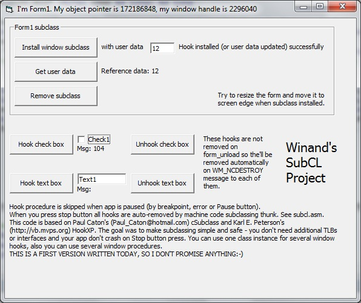



## SubCL

### Description

SubCL allows you to subclass windows while using breakpoints, Pause and Stop button in VB6 IDE. It's easy to use and safe (i hope). I combined Paul Caton's <a href="http://www.planet-source-code.com/vb/scripts/ShowCode.asp?txtCodeId=51403&lngWId=1">WinSubHook2</a> and Karl E. Peterson's <a href="http://vb.mvps.org/samples/HookXP/">HookXP</a> (though it wasn't very easy to write ASM procedure:-) To use this code in your project you need to include only 1 file - csubcl.cls. More info in a screeshot and source code.
 
### More Info
 

             |
---                |---
**Submitted On**   |2010-11-08 19:02:40
**By**             |[AndRAY](https://github.com/Planet-Source-Code/PSCIndex/blob/master/ByAuthor/andray.md)
**Level**          |Advanced
**User Rating**    |4.7 (14 globes from 3 users)
**Compatibility**  |VB 6\.0
**Category**       |[Debugging and Error Handling](https://github.com/Planet-Source-Code/PSCIndex/blob/master/ByCategory/debugging-and-error-handling__1-26.md)
**World**          |[Visual Basic](https://github.com/Planet-Source-Code/PSCIndex/blob/master/ByWorld/visual-basic.md)
**Archive File**   |[SubCL2192281182010\.zip](https://github.com/Planet-Source-Code/andray-subcl__1-73572/archive/master.zip)

